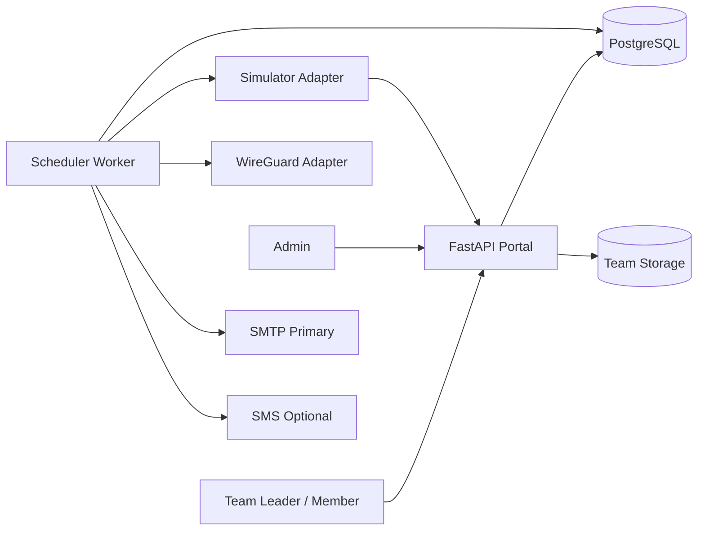

# NT Drone Competition Portal

MVP สำหรับบริหารการแข่งขันโดรนตั้งแต่ **สมัครทีม → Admin อนุมัติ → Login + 2FA → จอง Slot → เปิด VPN ตามเวลา → Run Simulation** พร้อมหน้า Team Dashboard, Admin Control Center, Swagger/OpenAPI, Worker สำหรับงานตามเวลา และ Adapter สำหรับ WireGuard/Simulator

## สิ่งที่มีในเวอร์ชันนี้

- สมัครทีมและแนบเอกสาร PDF/PNG/JPG แยก Storage ตาม Team ID
- Admin ตรวจเอกสารและ Approve/Reject ทีม
- บังคับ 2FA แบบ TOTP ทุก Login รองรับ Google Authenticator และแอปที่ใช้มาตรฐานเดียวกัน
- Role แยก `ADMIN`, `TEAM_LEADER`, `MEMBER`
- ทีม 2–4 คน โดย Team Leader เป็นผู้เพิ่มสมาชิกและจอง Slot
- Slot duration เริ่มต้น 3 ชั่วโมง, ตรวจเวลา Overlap, รองรับ Capacity/Waitlist
- ยกเลิก Booking แล้วติด Cooldown 5 นาที
- VPN default-disabled, สร้าง Key รายทีม, Worker เปิด/ปิด Peer ตาม Booking
- Simulation แบบ `STANDARD` และ `BLIND`, คำสั่ง Start/Stop/Cancel
- Data Contract สำหรับ Config, Metrics, Result และ Telemetry
- Queue API สำหรับ Remote Simulator แบบ Bearer Token
- SMTP เป็นช่องทางหลัก, SMS Webhook เป็นช่องทางเสริม
- Audit Log, Feedback, Health Check และ Docker Compose

## หน้าจอหลัก

| URL | หน้าที่ |
|---|---|
| `/` | Landing page และภาพรวม 6 ขั้นตอน |
| `/register` | สมัครทีมและแนบเอกสาร |
| `/login` | Login ก่อนเข้าสู่ 2FA |
| `/dashboard` | Team Dashboard, Booking, VPN และ Simulation |
| `/admin` | ตรวจทีม, สร้าง Slot และติดตามระบบ |
| `/docs` | Swagger / OpenAPI |
| `/healthz` | Health check |

## เริ่มใช้งานด้วย Docker Compose

```bash
cp .env.example .env

# ต้องเปลี่ยนอย่างน้อย SECRET_KEY และ ADMIN_PASSWORD
python -c "import secrets; print(secrets.token_urlsafe(48))"

docker compose up --build -d
docker compose logs -f api worker
```

เปิด `http://localhost:8000`

Admin เริ่มต้นอ่านค่าจาก:

```dotenv
ADMIN_USERNAME=admin
ADMIN_PASSWORD=ChangeMe-NTDrone-2026!
```

เปลี่ยนรหัสผ่านเริ่มต้นก่อนนำระบบขึ้นใช้งานจริง

## ทดลองแบบ Local โดยไม่ใช้ Docker

```bash
python -m venv .venv
source .venv/bin/activate
pip install -e '.[dev]'
cp .env.example .env

uvicorn app.main:app --reload
# เปิด Terminal อีกหน้าต่าง
python -m app.worker
```

ค่าเริ่มต้น Local ใช้ SQLite ที่ `./data/ntdrone.db` ส่วน Docker Compose ใช้ PostgreSQL

## สร้างข้อมูล Demo

```bash
python scripts/seed_demo.py
```

บัญชีตัวอย่าง:

```text
Team Leader: demo.leader / Demo-Team-123!
Member:      demo.member / Demo-Team-123!
```

Login ครั้งแรกจะแสดง QR Code ให้ตั้งค่า 2FA

## Architecture



รายละเอียดอยู่ใน [`docs/architecture.md`](docs/architecture.md)

## โหมด Integration

### VPN

```dotenv
VPN_DRIVER=mock        # Development
VPN_DRIVER=wireguard   # เรียก app/wireguard/enable_peer.sh และ disable_peer.sh
```

เมื่อใช้ WireGuard จริง Worker ต้องมี `CAP_NET_ADMIN` หรือเรียก Script ผ่าน sudo rule ที่จำกัดคำสั่งอย่างชัดเจน ห้ามให้ Web Process มีสิทธิ์ root แบบกว้าง

### Simulator

```dotenv
SIMULATION_DRIVER=mock
SIMULATION_DRIVER=http
SIMULATOR_API_URL=http://simulator-api:9000
SIMULATOR_API_TOKEN=<shared bearer token>
```

Remote Simulator เลือกได้สองรูปแบบ:

1. Push: Worker ส่ง `POST {SIMULATOR_API_URL}/runs`
2. Pull: Simulator เรียก `POST /api/v1/simulator/queue/next` แล้วส่งผลกลับที่ `POST /api/v1/simulator/runs/{run_id}/result`

## โครงสร้างโครงการ

```text
app/
├── main.py             # FastAPI application
├── worker.py           # VPN, Slot, Blind SIM, Notification scheduler
├── models.py           # SQLAlchemy models
├── services.py         # Business policies and adapters
├── security.py         # Argon2, signed sessions, TOTP, encryption
├── routers/            # Portal UI and REST API
├── templates/          # Editable HTML/Jinja templates
├── static/             # Enterprise blue/white UI
└── wireguard/          # Narrow enable/disable scripts
docs/                   # Architecture, policies, contracts, runbook
scripts/seed_demo.py
tests/
compose.yaml
```

## เอกสารนโยบายที่ล็อกไว้ใน MVP

- [`docs/data-contract.md`](docs/data-contract.md)
- [`docs/slot-policy.md`](docs/slot-policy.md)
- [`docs/access-policy.md`](docs/access-policy.md)
- [`docs/security.md`](docs/security.md)
- [`docs/api.md`](docs/api.md)
- [`docs/runbook.md`](docs/runbook.md)

## ทดสอบ

```bash
pytest
ruff check app tests scripts
```

## ขอบเขต MVP

ระบบนี้พร้อมใช้เป็นฐานพัฒนาและทดสอบ Integration แต่ยังไม่ใช่ Production Release ขั้นสุดท้าย งานที่ต้องทำก่อนใช้งานจริงประกอบด้วย Database migration ด้วย Alembic, External secrets manager, Backup/Restore test, HA strategy, Rate limiting, Central log/SIEM integration, WireGuard host hardening และ Load/DR test ตามปริมาณทีมจริง
