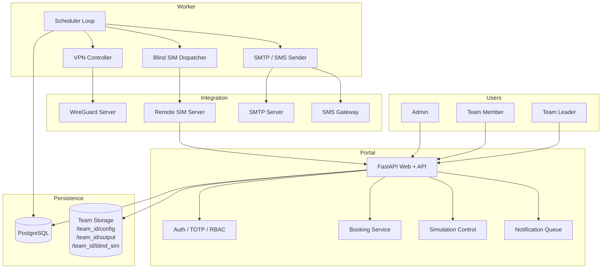

# Architecture

## เป้าหมาย

ระบบรองรับ Flow หลัก 6 ขั้นตอน:

1. สมัครทีมและแนบเอกสาร
2. Admin ตรวจสอบและอนุมัติสิทธิ์
3. Login และยืนยันตัวตนด้วย 2FA
4. Team Leader จอง Slot
5. เปิด VPN เฉพาะช่วงเวลาที่จอง
6. เริ่ม Simulation และรับ Result/Telemetry

## Logical Architecture



## Deployment Components

### `api`

- Server-rendered Portal และ REST API
- Swagger/OpenAPI ที่ `/docs`
- รับเอกสารสมัคร, Config JSON และ Simulator callbacks
- ไม่มีสิทธิ์แก้ Network โดยตรง

### `worker`

- ตรวจ Booking ตามเวลาจริง
- Enable/Disable VPN Peer
- Dispatch Blind Simulation
- ปิด Booking ที่หมดเวลา
- ประมวลผล Notification
- ควรมีเพียงหนึ่ง Active Worker ต่อ Environment ใน MVP

### `db`

PostgreSQL เก็บข้อมูล Team, User, Slot, Booking, VPN metadata, Simulation, Feedback, Notification และ Audit Log

### Team Storage

```text
/data/teams/<team_id>/
├── documents/
├── config/
├── blind_sim/
└── output/<run_id>/
```

## Trust Boundaries

- Internet/User Zone → Reverse Proxy → Portal API
- Portal API → PostgreSQL/Storage
- Worker → WireGuard Host และ Remote Simulator
- Remote Simulator → Callback API ผ่าน Bearer Token
- Admin UI ใช้ Role `ADMIN` และ 2FA เหมือนบัญชีอื่น

## Scale-out Direction

MVP ใช้ Worker เดียวเพื่อหลีกเลี่ยง Scheduler ซ้ำ หากต้อง Scale:

1. ย้ายงาน Scheduler เป็น Queue เช่น Redis/RabbitMQ
2. ใช้ PostgreSQL advisory lock หรือ distributed lock
3. แยก VPN Controller เป็น privileged service ใน Network Zone
4. แยก Simulation Runner ตาม Resource Pool
5. ใช้ Object Storage สำหรับ Output/Video
6. เพิ่ม Load Balancer หน้า API ซึ่งเป็น stateless หลังใช้ shared session/signing key
