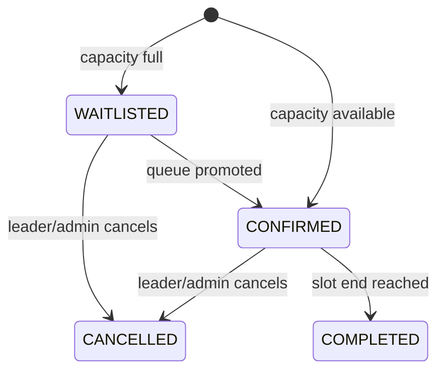

# Slot Policy v1

## กฎที่ใช้ใน MVP

1. Booking อ้างอิง `Team ID + Slot ID`
2. Team Leader เท่านั้นที่สร้างหรือยกเลิก Booking ของทีม
3. ทีมต้องอยู่ในสถานะ `APPROVED`
4. ต้องมีสมาชิก Active 2–4 คนรวมหัวหน้าทีม
5. Duration เริ่มต้น 180 นาที หรือ 3 ชั่วโมง
6. ทีมเดียวกันห้ามมี Booking ที่เวลา Overlap กัน
7. Slot มี `capacity`; เมื่อเต็ม Booking ใหม่เป็น `WAITLISTED`
8. Queue เริ่มจาก 1 ส่วน Booking ที่ยืนยันแล้วใช้ `queue_position = 0`
9. เมื่อ Booking ที่ยืนยันถูกยกเลิก ระบบเลื่อน Queue แรกเป็น `CONFIRMED`
10. หลังยกเลิก ทีมติด Cooldown 300 วินาทีก่อนจองใหม่
11. ห้ามจอง Slot ที่เริ่มแล้วหรือปิดรับการจอง
12. Worker เปลี่ยน Booking เป็น `COMPLETED` เมื่อเวลาสิ้นสุด

## Overlap Definition

ช่วงเวลา A และ B ชนกันเมื่อ:

```text
A.start < B.end AND B.start < A.end
```

ดังนั้น Slot ที่เริ่มทันทีหลังอีก Slot สิ้นสุดไม่ถือว่าชน

## State Model



## ประเด็นที่ต้องล็อกเพิ่มก่อน Production

- Cancel cutoff เช่น ห้ามยกเลิกก่อนเริ่มน้อยกว่า 30 นาทีหรือไม่
- No-show policy
- Resource Pool มากกว่าหนึ่ง Simulator
- Maintenance window และ blackout date
- Admin override พร้อมเหตุผลและ Audit
- Team quota ต่อรอบการแข่งขัน
